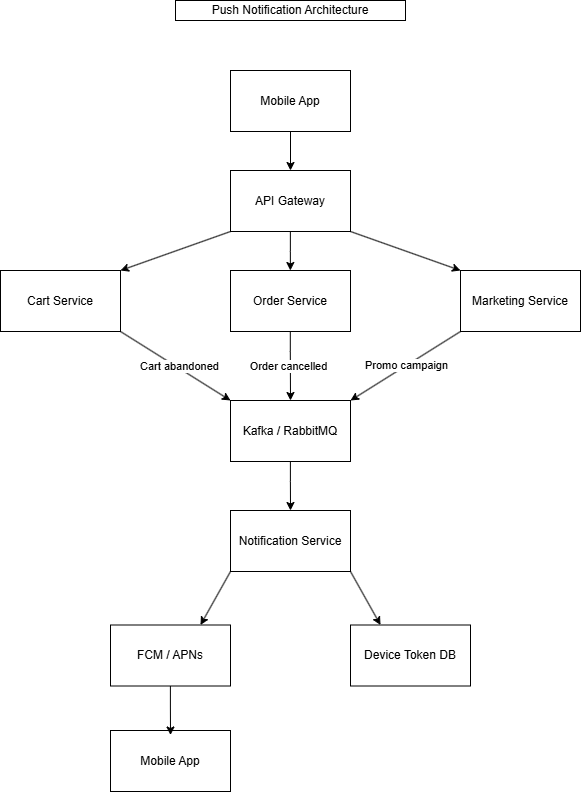

# Задание 3. Архитектура PUSH-уведомлений

## Архитектурная диаграмма

## Цель

Обеспечить отправку PUSH-уведомлений пользователям мобильного приложения интернет-магазина «Петрушка Зеленая».

Примеры уведомлений:

- заказ отменен;
- заказ успешно оформлен;
- товары долго находятся в корзине без оформления;
- рекламные рассылки;
- персональные предложения.

---

# Верхнеуровневая архитектура

Архитектура построена на событийном взаимодействии микросервисов через брокер сообщений.

Используемые компоненты:

- Mobile App;
- API Gateway;
- Cart Service;
- Order Service;
- Marketing Service;
- Kafka / RabbitMQ;
- Notification Service;
- Device Token DB;
- FCM / APNs.

---

# Описание компонентов

## Mobile App

Мобильное приложение пользователя.

Получает PUSH-уведомления и отображает их пользователю.

---

## API Gateway

Единая точка входа для мобильного приложения.

Передает запросы в соответствующие микросервисы.

---

## Cart Service

Отвечает за работу корзины.

Генерирует события:

- CartAbandoned;
- CartUpdated.

---

## Order Service

Отвечает за работу заказов.

Генерирует события:

- OrderCreated;
- OrderCancelled;
- OrderDelivered.

---

## Marketing Service

Формирует рекламные кампании и рассылки.

Генерирует события:

- PromotionStarted;
- PromotionScheduled.

---

## Kafka / RabbitMQ

Брокер сообщений.

Используется для передачи событий между сервисами без прямой зависимости друг от друга.

---

## Notification Service

Получает события из брокера сообщений.

Определяет:

- кому отправлять уведомление;
- какой текст уведомления использовать;
- через какой канал отправлять уведомление.

После формирования уведомления отправляет его в FCM/APNs.

---

## Device Token DB

Хранит push-токены мобильных устройств пользователей.

Используется Notification Service для поиска устройства получателя.

---

## FCM / APNs

Сервисы доставки PUSH-уведомлений.

- Firebase Cloud Messaging (Android);
- Apple Push Notification Service (iOS).

---

# Сценарий отправки уведомления

Пример: заказ отменен.

1. Пользователь оформил заказ.
2. Заказ был отменен.
3. Order Service публикует событие OrderCancelled.
4. Событие попадает в Kafka / RabbitMQ.
5. Notification Service получает событие.
6. Notification Service получает push-токен пользователя из Device Token DB.
7. Notification Service формирует текст уведомления.
8. Уведомление отправляется через FCM/APNs.
9. Пользователь получает PUSH-уведомление в мобильном приложении.

---

# Преимущества решения

- слабая связанность сервисов;
- возможность масштабирования;
- централизованная логика уведомлений;
- поддержка различных типов уведомлений;
- возможность подключения дополнительных каналов доставки в будущем.
